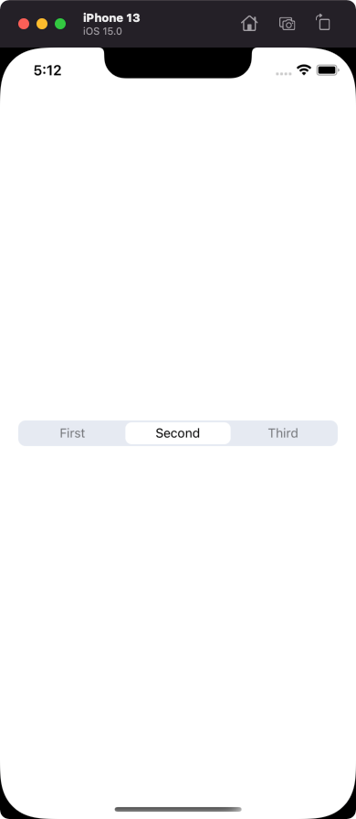

# segmented-control-rn

React Native Segmented control



## Installation

```sh
npm install segmented-control-rn
```

## Usage

```js
import React, { useState } from 'react';
import { StyleSheet, Text, View, Image } from 'react-native';
import SegmentedControl from "segmented-control-rn";

const INACTIVE_COLOR = 'rgba(0, 0, 0, 0.5)';
const ACTIVE_COLOR = 'rgb(0, 0, 0)';

const segments = [
  {
    active: <Text style={{ color: ACTIVE_COLOR }}>First</Text>,
    inactive: <Text style={{ color: INACTIVE_COLOR }}>First</Text>,
  },
  {
    active: <Text style={{ color: ACTIVE_COLOR }}>Second</Text>,
    inactive: <Text style={{ color: INACTIVE_COLOR }}>Second</Text>,
  },
  {
    active: <Text style={{ color: ACTIVE_COLOR }}>Third</Text>,
    inactive: <Text style={{ color: INACTIVE_COLOR }}>Third</Text>,
  },
];

// ...

const [activeIndex, setActiveIndex] = useState(0);

return (
  <SegmentedControl
    onChange={(index) => setActiveIndex(index)}
    segments={segments}
    selectedIndex={activeIndex}
  />
);
```

## Props

### `backgroundColor`

Background color of the Segmented Control.

| Type   | Required | Default value |
| ------ | -------- | ------------- |
| string | No       | #E6EAF2       |

### `tintColor`

Primary color of the active segment

| Type   | Required | Default value |
| ------ | -------- | ------------- |
| string | No       | #FFFFFF       |

### `selectedIndex`

Index of the selected segment.

| Type   | Required | Default value |
| ------ | -------- | ------------- |
| number | Yes      | 0             |

### `disabled`

If it `true` then makes segments disabled and sets `opacity` to `0.4`.

| Type   | Required | Default value |
| ------ | -------- | ------------- |
| number | No       | false             |

## Contributing

See the [contributing guide](CONTRIBUTING.md) to learn how to contribute to the repository and the development workflow.

## License

MIT
